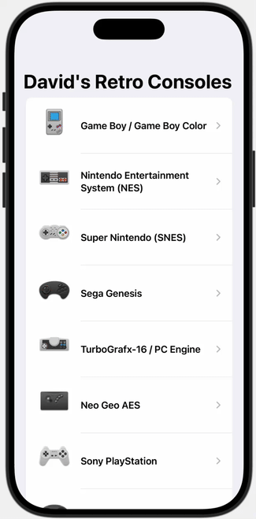

# Retro Console Collection
A SwiftUI app that showcases my favorite classic retro gaming consoles with detailed information

## Assignment Details
- **Assignment**: Midterm Programming Assignment  
- **Course**: CIS 137
- **Developer**: David Deng
- **Date**: October 19, 2025

## Features
- Browse 12 classic retro gaming consoles
- Detailed view for each console with specifications
- High-quality console images and icons
- JSON data loading with custom decoding
- Smooth navigation between list and detail views

## How to Use
1. Launch the app to see the main console list
2. Scroll through the collection of retro consoles
3. Tap any console to view detailed information
4. See release dates, manufacturers, descriptions, and notable games
5. Use the back button to return to the main list

## Technical Details
- Built with SwiftUI
- Uses JSON file for data storage
- Custom JSON decoding with Bundle extension
- NavigationView with list-detail pattern
- @State-free design with immutable data flow

## Consoles Included
- Game Boy / Game Boy Color
- Nintendo Entertainment System (NES)
- Super Nintendo (SNES)
- Sega Genesis
- TurboGrafx-16 / PC Engine
- Neo Geo AES
- Sony PlayStation
- Sega Saturn
- Virtual Boy
- Neo Geo Pocket / Color
- WonderSwan / Color
- Game Boy Advance

## Setup
1. Clone the repository
2. Open `Midterm_DavidDeng.xcodeproj` in Xcode
3. Run project on iPhone simulator or device
